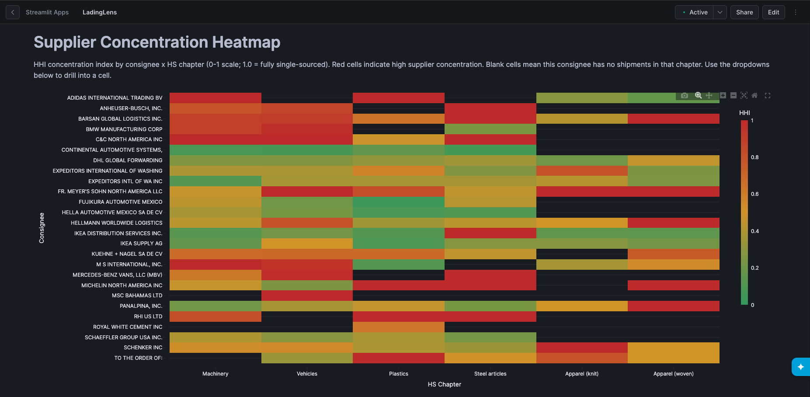
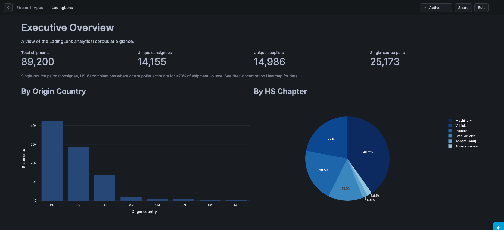
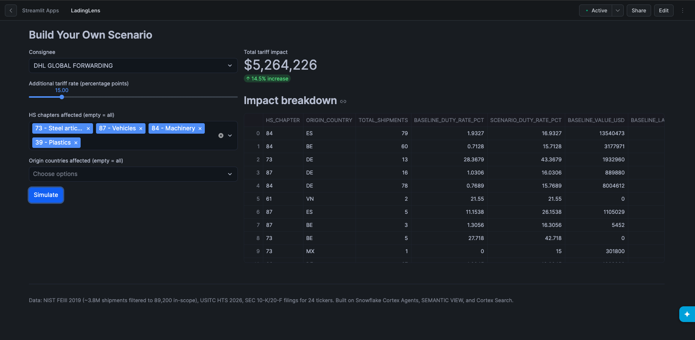
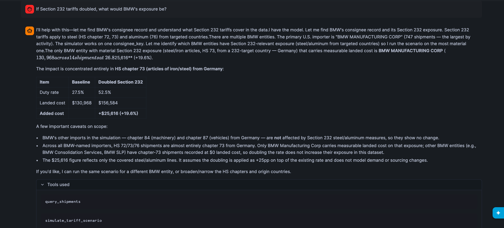
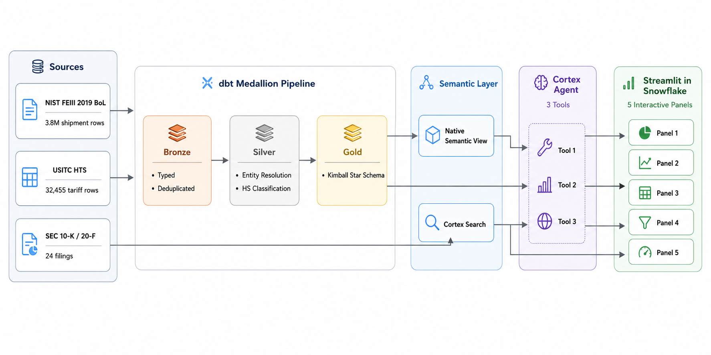

# LadingLens

[](https://github.com/Aadarsh-Praveen/LadingLens/actions/workflows/lint.yml)
[](https://github.com/Aadarsh-Praveen/LadingLens/actions/workflows/dbt-compile.yml)

**Tariff exposure and supplier concentration copilot**, built on Snowflake Cortex and a dbt medallion pipeline over 89,200 real US customs shipment records.



**Demo video:** [link pending recording — see `docs/DEMO.md`]

---

## The Problem

US importers facing a shifting tariff landscape (Section 232 steel/aluminum, Section 301 China measures) need to know two things fast: how concentrated is my supplier base for a given product category, and what would a specific tariff change actually cost me? Answering either question today means manually cross-referencing bill-of-lading records, the USITC Harmonized Tariff Schedule, and SEC 10-K risk disclosures — three data sources that never talk to each other.

LadingLens fuses all three into a single Snowflake-native pipeline: real US customs shipment data, entity-resolved suppliers and consignees, an HS-code classifier, a Kimball star schema, a native semantic layer, a retrieval service over SEC filings, and a conversational agent that can chain structured queries, unstructured retrieval, and what-if scenario simulation into one answer.

## What It Does

**Concentration Heatmap** — supplier/country HHI by consignee × HS chapter, computed at the correct aggregation grain (not averaged from finer-grained pre-computed values, which would be mathematically wrong — see [Data Quality Discipline](#data-quality-discipline)).



**Tariff scenario simulator** — pick a consignee, dial up a tariff rate on specific HS chapters and origin countries, get real before/after landed cost.



**10-K risk factor retrieval** — Cortex Search over 24 SEC 10-K/20-F filings, retrieves verbatim disclosure language on demand.

**Conversational agent** — a Cortex Agent chains structured semantic-view queries, 10-K retrieval, and the scenario simulator to answer fusion questions like *"If Section 232 tariffs doubled, what would BMW's exposure be?"*



That last screenshot is the single hardest architectural claim in this project: the agent identifies the material BMW entity from a structured lookup, runs the tariff simulator against it, and reports a scoped, self-aware answer ($130,968 → $156,584 landed cost, +$25,616/+19.6%, correctly noting other BMW entities carry zero recorded landed cost on that exposure so their numbers don't move).

**Observability** — a fifth panel logs every agent query to a Snowflake table (`AGENT_TRACES`) and reports real latency distributions and tool-usage breakdowns, plus a per-query cost estimate derived from response token counts against published Cortex pricing — explicitly labeled an estimate, not measured billing, since `CORTEX_FUNCTIONS_USAGE_HISTORY` doesn't populate on this account (see `docs/roadmap.md`).

## Architecture



Full writeup with tool-choice tradeoffs and layer-by-layer detail: [`docs/architecture.md`](docs/architecture.md).

### Why this stack, not the obvious alternatives

- **Native `SEMANTIC VIEW`, not Cortex Analyst directly** — Cortex Analyst's standalone API is gated on this account tier (`SNOWFLAKE.CORTEX.ANALYST` module not installed), discovered while building Phase 6. The native `SEMANTIC VIEW` object isn't gated the same way, and — a genuine surprise found in Phase 8 — Cortex Agent's `cortex_analyst_text_to_sql` tool type is Cortex Analyst *embedded*, and that works fine even though the standalone product doesn't. Two different gates on the same underlying capability.
- **A Snowpark stored procedure, not a UDTF, for the tariff scenario simulator** — confirmed directly (not assumed) that `get_active_session()` fails inside a Python UDTF on this account with `SnowparkSessionException: No default Session is found`. Stored procedures receive the session as a handler argument automatically; UDTFs don't get one at all here.
- **Kimball star schema, not Data Vault** — this project has one clear grain (a shipment) and a small, stable set of dimensions. Data Vault's hub/link/satellite modeling pays off at much higher schema-change velocity than a 10-day hackathon build has.
- **Cortex Search, not a hand-rolled retrieval UDTF** — Phase 5 already proved a hand-rolled Snowpark UDTF can out-perform naive SQL for vector similarity (10+ hours to 17 seconds), but Cortex Search's managed chunking/embedding/indexing meant Phase 7 didn't need to re-solve a problem Snowflake already solved for unstructured text specifically.

## Data Sources

| Source | Description | Size | License | Retrieved |
|---|---|---|---|---|
| NIST FEIII 2019 BoL sample | US customs bill-of-lading records (CBP AMS filings) | 3,825,304 rows parsed, 456,014 distinct container line-items after dedup | Public research dataset (US government/NIST) | 2026-07-23 |
| USITC Harmonized Tariff Schedule | HS-code tariff schedule, duty rates | 32,455 rows ingested | US government, public domain | 2026-07-23 |
| SEC EDGAR 10-K/20-F filings | Risk-factor disclosures for 24 tickers | 24 filings, ~2.5M chars post-cleanup | Public domain (US government filings) | 2026-07-23 to 07-27 |

Full provenance, messiness notes, and every data-quality catch: [`data/sources.md`](data/sources.md).

## Key Metrics

Full canonical table: [`docs/metrics.md`](docs/metrics.md). Headline numbers:

- **89,200** in-scope shipments (from 3.8M raw rows, scoped to HS chapters 84/87/39/73/61/62 — machinery, vehicles, plastics, steel, apparel — across 8 origin countries: BE, CN, DE, ES, FR, GB, MX, VN)
- **41,338** golden supplier entities, **40,629** golden consignee entities (entity resolution via Cortex embeddings + connected-components clustering)
- **96.6%** of shipments received a usable HS code (source field, regex extraction, or LLM classification)
- **1,674** chunks indexed from 24 SEC filings via Cortex Search
- **Cortex Agent smoke test: 9 of 10 questions strong, 1 partial**, including both fusion queries tested — p50 latency 38.3s, p95 93.2s
- **85 dbt tests** (83 pass, 2 intentional warns, 0 errors)
- **40+ documented data-quality catches** across phases, each with root cause analysis (see below)

## Tech Stack

| Layer | Tool | Why |
|---|---|---|
| Transformation | dbt-core + dbt-snowflake | Medallion architecture (Bronze/Silver/Gold), version-controlled SQL, built-in testing |
| Entity resolution | `SNOWFLAKE.CORTEX.EMBED_TEXT_768` + connected-components clustering | No external ML infra; embeddings + char-similarity scoring in-warehouse |
| HS classification | Retrieval-augmented `AI_COMPLETE` (llama3.1-8b) + Snowpark UDTF | UDTF for vectorized nearest-candidate retrieval — see below |
| Semantic layer | Native Snowflake `SEMANTIC VIEW` | Cortex Analyst's standalone API is gated on this account tier; the native object isn't |
| Unstructured retrieval | Cortex Search | Managed chunking + embedding + vector index, no hand-rolled retrieval infra |
| Orchestration | Cortex Agent | Chains the semantic view, Cortex Search, and a custom scenario procedure behind one conversational interface |
| Scenario simulation | Snowpark Python stored procedure | UDTFs can't obtain a session on this account (`get_active_session()` confirmed hard-broken); procedures can |
| UI | Streamlit-in-Snowflake | No external hosting, no separate auth — runs inside Snowflake compute |

## How to Run

Prerequisites: a Snowflake account with Cortex enabled, a warehouse, and enough credits (this project used ~24 of a 50-credit budget on warehouse compute; Cortex serverless spend is separate, see [`docs/metrics.md`](docs/metrics.md)).

```bash
git clone <this repo>
cd LadingLens
cp .env.example .env   # fill in Snowflake connection details
python -m venv .venv && source .venv/bin/activate
pip install -r requirements.txt

# Bootstrap schemas, warehouse, resource monitor
snowsql -f scripts/bootstrap_snowflake.sql

# Ingest raw data
python scripts/ingest/01_bol_shipments.py
python scripts/ingest/02_usitc_hts.py
python scripts/ingest/03_sec_10k.py

# Build the dbt medallion pipeline
cd dbt/ladinglens
dbt deps && dbt build

# Publish the semantic layer, search service, agent (see individual scripts/ files)
snowsql -f ../../scripts/publish_semantic_view.sql
snowsql -f ../../scripts/publish_cortex_search.sql
snowsql -f ../../scripts/create_tariff_scenario_udf.sql
snowsql -f ../../scripts/create_tariff_scenario_agent_wrapper.sql
snowsql -f ../../scripts/publish_agent.sql

# Deploy the Streamlit app (see scripts/deploy_streamlit.sql for the full
# upload + environment.yml sequence)
snowsql -f ../../scripts/deploy_streamlit.sql
```

Every phase's build decisions, verified findings, and deviations from plan are captured in `docs/architecture.md` (design tradeoffs), `docs/metrics.md` (numbers), `docs/roadmap.md` (deferred work), and `data/sources.md` (data-quality catches).

## Repo Layout

```
scripts/ingest/           Raw data ingestion (BoL, USITC HTS, SEC 10-K/20-F)
dbt/ladinglens/models/
  bronze/                 Typed, deduplicated raw tables
  silver/                 Entity resolution (suppliers/consignees) + HS classification
  gold/                   Kimball star schema, concentration mart, scenario mart
dbt/ladinglens/seeds/     Hand-curated reference data (tariff events, eval seeds)
dbt/ladinglens/tests/     Singular dbt tests (arithmetic assertions, row-count bounds)
scripts/                  Publish/deploy scripts for each Snowflake-native object
  publish_semantic_view.sql
  publish_cortex_search.sql
  create_tariff_scenario_udf.sql          (VARIANT param, used directly + by mart_scenario_examples)
  create_tariff_scenario_agent_wrapper.sql (scalar params, used by the Cortex Agent)
  publish_agent.sql
  deploy_streamlit.sql
agent/ladinglens_agent.yaml   Cortex Agent specification (readable copy; publish_agent.sql is the source of truth)
streamlit/                Streamlit-in-Snowflake app (5 panels)
docs/screenshots/          8 screenshots from the live deployed app
docs/architecture/         Architecture diagrams referenced in this README and docs/architecture.md
data/sources.md            Full data provenance + every documented data-quality catch
```

## Project Timeline

Built solo across 10 phases in ~7-8 calendar days (first commit 2026-07-22, most recent commit 2026-07-29) — foundation and ingestion, EDA and scope-pivot, dbt entity resolution, retrieval-augmented HS classification, the Gold star schema and semantic view, Cortex Search, the Cortex Agent and scenario simulator, the Streamlit UI, and finally observability/CI/CD/demo packaging, in that order.

## Data Quality Discipline

This project treats data-quality findings as a first-class deliverable, not an afterthought. 40+ catches are documented across phases with root cause analysis — not just "found a bug," but *why* it happened and what the fix was. A few representative examples:

- **A Snowpark UDTF rewrite dropped an embedding-retrieval query from >10 hours (unresolved, never completed on a naive SQL cross-join) to 17 seconds** — the bottleneck was CPU-bound vector math, not memory or warehouse size, and only a vectorized numpy rewrite inside a UDTF solved it.
- **A dormant Bronze-layer extraction bug silently contaminated 13 of 24 SEC 10-K filings** with financial-statement and audit-opinion text (Item 1A risk-factor extraction running past its intended boundary) — caught not by an automated test, but by manually spot-checking a retrieval chunk that looked like a financial table instead of prose. 9 of 13 were fixed with a broadened end-boundary regex; 2 (LULU, MU) remain genuinely contaminated due to a harder, different bug (a start-selection heuristic issue, not a missing boundary) and are documented as future work.
- **A tariff-scenario arithmetic bug produced phantom nonzero cost deltas for scenarios that shouldn't have applied at all** — caught by noticing four *different* scenarios produced an *identical* delta for the same shipment group, which is mathematically impossible if the scenarios genuinely didn't match. Root cause: recomputing landed cost from a chapter-averaged duty rate instead of adding the rate increment on top of the true per-shipment baseline.
- **Two confirmed Cortex Agent platform incompatibilities**, found only by testing minimal repro cases against the live account: the `generic` tool type rejects object/VARIANT-typed parameters outright, and independently cannot invoke a `RETURNS TABLE` stored procedure at all (only scalar returns work) — neither limitation is documented anywhere I could find at the time of writing.

Full list, with the reasoning behind every judgment call: [`data/sources.md`](data/sources.md).

## Deferred Work

Every deferred item has a specific production path forward, not just a TODO. Full list: [`docs/roadmap.md`](docs/roadmap.md).

## Author

Aadarsh Praveen — built solo for the Snowflake CoCo CLI Hackathon 2026.
