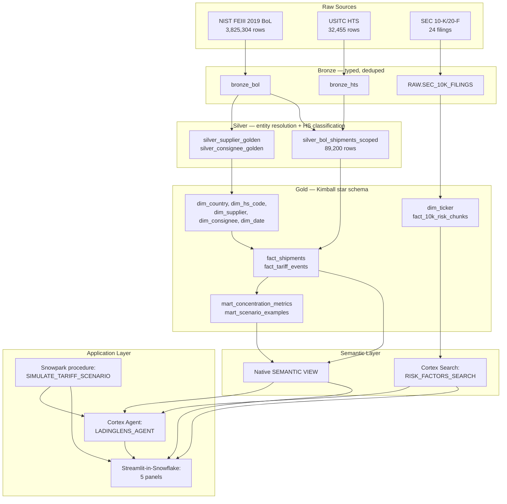

# LadingLens — Architecture

## 1. High-level architecture

## 2. Data flow

3.8M raw BoL rows (`NIST FEIII 2019`, a CBP AMS extract) go through three narrowing steps before reaching the 89,200-shipment analytical base:

1. **Bronze dedup** (Phase 4): the correct grain turned out to be `(identifier, container_number)`, not `(identifier, description_sequence_number)` as first assumed — the latter silently collapsed 259K distinct shipments because that sequence number isn't unique per container line within a single bill of lading. Bronze retains 456,014 genuinely distinct container line-items after this correction.
2. **Silver scoping** (Phase 4): filtered to 8 origin countries (BE, CN, DE, ES, FR, GB, MX, VN) reflecting a scope pivot from an original Section 301/China framing to Section 232 steel/EU-auto + Vietnam-apparel, once EDA showed where the real data density actually was.
3. **HS-chapter scoping, applied AFTER classification** (Phase 5): the original design filtered to HS chapters 84/87/39/73/61/62 *before* running the classifier, which by construction meant every remaining row already had a known HS code — making it structurally impossible for the classifier to ever encounter a row it needed to classify. Moving the chapter filter to run after classification let the classifier meaningfully expand the in-scope population from 52,611 to 89,200 shipments.

## 3. Layer-by-layer detail

**Bronze**: raw ingestion, typing, deduplication. No business logic. `bronze_hts`'s `ad_valorem_rate` column is parsed once here from free-text `general_rate_text` (e.g. `'3.4%'` → `0.034`, specific/compound rates like `'1.5¢/kg'` → `NULL`) and reused downstream rather than re-parsed.

**Silver**: two independent problems solved in parallel.
- *Entity resolution* (Phase 4): connected-components clustering over Cortex-embedding + character-similarity scored name pairs, threshold locked at 0.92 to favor precision (avoiding merging same-brand-different-legal-entity pairs like BMW Manufacturing Corp vs. BMW Canada) over recall.
- *HS classification* (Phase 5): a three-tier waterfall — source field (where CBP-filed data already has a code), regex extraction from free text, then a retrieval-augmented LLM classifier (Cortex `AI_COMPLETE`) for everything else, with an explicit permission to override low-confidence retrieval candidates when the LLM's own domain knowledge is more reliable than the retrieved candidates.

**Gold**: a standard Kimball star schema (`fact_shipments` at shipment grain, conformed dimensions), plus two marts (`mart_concentration_metrics` at consignee × HS-6 grain, `mart_scenario_examples` pre-computing 5 canonical tariff scenarios across the top 20 consignees) and a separate `dim_ticker`/`fact_10k_risk_chunks` pair for the unstructured side.

**Semantic**: the Gold star schema is exposed two ways — a native `SEMANTIC VIEW` for structured NL-to-SQL, and a Cortex Search service over chunked 10-K text for unstructured retrieval.

**Application**: a Cortex Agent orchestrates three tools (the semantic view, Cortex Search, and a tariff scenario stored procedure) behind one conversational interface, surfaced through a 4-panel Streamlit-in-Snowflake app.

## 4. Tool choices with tradeoffs

**Kimball star schema vs. Data Vault** — Data Vault's hub/link/satellite modeling earns its complexity at high schema-change velocity and multi-source integration scale. This project has one grain (a shipment), a small conformed dimension set, and a fixed 9-day build window — a star schema is the right amount of structure, not under- or over-engineered for the problem.

**Native `SEMANTIC VIEW` vs. Cortex Analyst** — Cortex Analyst's standalone API (`SNOWFLAKE.CORTEX.ANALYST`) is not installed on this account tier, discovered directly in Phase 6 (not assumed — confirmed via a failed publish attempt). The native `SEMANTIC VIEW` object is a separate Snowflake feature that isn't gated the same way. The genuinely surprising finding came in Phase 8: Cortex Agent's `cortex_analyst_text_to_sql` tool type *is* Cortex Analyst, used internally by the agent, and it works fine — meaning the standalone product and the agent-embedded capability are gated independently on this account, something worth knowing before assuming "Analyst is unavailable" rules out agent-embedded text-to-SQL.

**Cortex Search vs. hand-rolled retrieval** — Phase 5 already proved a hand-rolled approach (a Snowpark UDTF doing vectorized numpy similarity search) can dramatically outperform naive SQL for vector similarity when the built-in tooling doesn't fit — that specific problem (structured HS-code retrieval against a small, static reference table) needed a custom solution. Unstructured document chunking, embedding, and indexing over 24 SEC filings is exactly the problem Cortex Search is built for, so Phase 7 used the managed service rather than re-deriving the same UDTF pattern for a different-shaped problem.

**Cortex Agent vs. LangChain (or a hand-rolled orchestrator)** — the whole point of this project was a Snowflake-native stack; introducing an external orchestration framework would mean managing its own auth, hosting, and tool-calling conventions outside Snowflake. Cortex Agent's `generic` tool type does have real, confirmed limitations (see below) that a framework like LangChain wouldn't have — but working around them (a scalar-parameter, `RETURNS STRING` wrapper procedure) was less total effort than standing up and securing an external service for a 9-day build.

## 5. Compute optimization highlights

**Snowpark UDTF for embedding retrieval (Phase 5)**: the HS-classification retrieval step needed, for each of ~73,000 distinct product texts, the top-5 nearest HS-6 candidates out of ~6,630 reference embeddings — effectively a 73K × 6,630 similarity matrix. A naive SQL cross-join ran unresolved for 10+ hours on an X-Small warehouse; a 10-way hash-batched version still hadn't finished after 30 minutes even on a 4x-larger Medium warehouse. A Snowpark UDTF doing the same computation as a single vectorized numpy matrix multiplication, with the reference embeddings staged as an `IMPORTS` file (`get_active_session()` isn't available inside a UDTF execution context, so the reference data has to be read from a staged file, not queried live), solved it in 17 seconds. The bottleneck was CPU-bound vector math, not memory spill or warehouse size — no amount of warehouse resizing would have fixed the naive approach.

**Stored procedure vs. UDTF for the scenario simulator (Phase 8)**: confirmed directly (a minimal probe UDTF failed with `SnowparkSessionException: No default Session is found`) that Python UDTFs on this account cannot obtain a Snowpark session at all. Stored procedures receive the session as their first handler argument automatically. The tariff scenario simulator was built as a stored procedure for this reason — and later needed a *second*, scalar-parameter/`RETURNS STRING` version specifically for Cortex Agent's `generic` tool, which independently can't pass a VARIANT parameter or invoke a `RETURNS TABLE` procedure (two separate, confirmed platform limitations, not one).

## 6. Known limitations and production paths

See [`docs/roadmap.md`](roadmap.md) for the full list with root causes and specific production fix paths.
